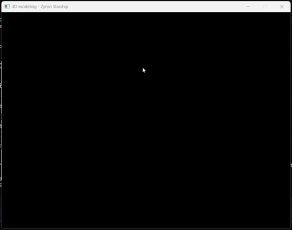

# Spacecraft-modeling
Este proyecto utiliza Rust para cargar, renderizar y controlar una nave espacial 3D a partir de un archivo OBJ. Implementa un pipeline de renderizado simple y controles de cámara para una experiencia interactiva en 3D.

## Requisitos
Asegúrate de tener Rust y Cargo instalados en tu sistema. Puedes verificarlo ejecutando:
```bash
    cargo --version
```

## Instalación y Configuración
1. **Clona el repositorio**:
    ```bash
    git clone <repository-url>
    ```
2. **Navega al directorio**:
   ```bash
    cd <repository-name>
    ```
3. **Instala las dependencias**:
    ```bash
    cargo add minifb nalgebra-glm tobj
    ```
3. **Compila y ejecuta el proyecto**:
    ```bash
    cargo run --release
    ```
## Controles
Una vez dentro del programa, puedes interactuar con la nave espacial utilizando los siguientes controles:
- **Movimiento de Cámara**
  -  Flecha Izquierda: Mueve la cámara hacia la izquierda.
  - Flecha Derecha: Mueve la cámara hacia la derecha.
  - Flecha Arriba: Mueve la cámara hacia arriba.
  - Flecha Abajo: Mueve la cámara hacia abajo.
- **Zoom**
  - Q: Acercar (Zoom in).
  - E: Alejar (Zoom out).
- **Rotación de la Nave**
  - A: Rotar la nave a la izquierda (eje Y).
  - D: Rotar la nave a la derecha (eje Y).
  - W: Rotar la nave hacia arriba (eje X).
  - S: Rotar la nave hacia abajo (eje X).
- **Salir**
  - Escape: Cierra la aplicación.

## Vista Previa de la Nave en Movimiento

